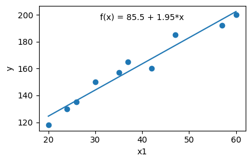
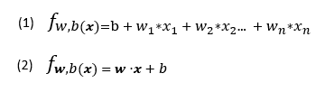
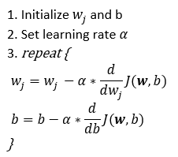
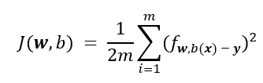
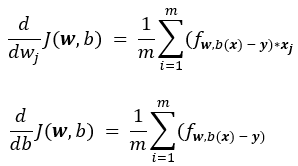

## Linear Regression From Scratch

This repo consists of three elements
<br> 1. *main.py:* Full implementation
<br> 2. *Example.ipynb:* Short example how to use the code
<br> 3. *README.md:* Relatively extensive explanations of implementation

You will find explanation of the steps I have implemented in Python in a detailed form also providing
few concise and required mathematical concepts,formulas and their components. Main goal of this text is implementation itself. 
Before diving into code it is better to have a very short intro to Linear Regression and Gradient Descent. I will provide relevant
links for further reading.
<br></br>

### Very Short Intro to Linear Regression and Gradient Descent
#### Linear Regression
Linear Regression is a type of supervised ML algorithm that is utilized to establish a model of the linear relationship between a 
dependent (target) variable and one or more independent variables (features). This relationship is  then utilized to predict 
quantitative outcomes based on the features. Below you can see a simple linear regression model which 
captures and translates the linear relationship between y and x1 accurately into parameter level.
How to achieve the parameters resulting in accurate fit is the topic of this text.


<br>To indicate regression in a formula you can see two forms below, (1) standard form and (2) vectorized form 
<br>which is the one I used in implementation as well, so better to take second one into account.


<br>w: Weight parameter vector containing coefficients(weights) for each feature
<br>b: Bias parameter scalar containing intercept(bias) parameter
<br>x: Feature matrix
<br></br>

#### Gradient Descent
Gradient descent is a first order optimization algorithm utilized in solving Machine Learning problems such that minimizing 
cost functions. Basically it requires two components: a direction and a learning rate.
Using these components it actually, in each iteration, takes a step towards  minima of J, cost function(defined below). 
Here is the implementation steps below:



### Implementation
#### 1. Cost Function (get_cost)
Cost function is a mathematical function that helps us to measure how well our model is performing with respect to
the real values. In that sense, we need to define a cost function for our algorithm which is 'Squared Error' in Linear Regression 
case as a prevalent one. Our major focus is to minimize this cost function J finding appropriate parameter vector.
We basically take square of the difference between predictions and real values of target variable and aggregate it 
to see how well our model is doing. It is as follows:


<br>w: Parameter vector (weights)
<br>b: Parameter scalar (bias)
<br>m: number of observation
<br>x: feature matrix
<br>y: target variable vector

```
m = X.shape[0]                      # Taking number of observations
err = ((X.dot(w) + b) - y) ** 2     # Finding squared errors vector, X.dot(w) gives us w1*x1 + w2*x2 + ..wn*xn
cost = (err.sum() / (2 * m))        # Take sum over 2 times m
```
<br></br>
#### 2. Calculating Gradient (get_gradient)

Gradient is basically the first deritivative of our cost function J referring to the rate of change of the function 
with respect to the model parameters.
In another word, gradient is a vector that points in the direction of the greatest increase of the cost function, 
and its magnitude represents the slope of the function in that direction. In gradient descent, 
we want to minimize the cost function, so we adjust the model parameters in the opposite 
direction of the gradient vector, taking small steps proportional to the negative of the 
gradient, until we reach a minimum point where the cost function is the smallest.


<br>
To calculate the gradient for a parameter wj in the cost function J, we subtract the predicted values from the actual
ones and multiply the result with the corresponding feature xj, then take sum of this over the number of observations. 
This gives us the slope and direction for wj in J. We can follow a similar 
process to compute the gradient for the bias parameter b, 
but without multiplying it with any feature vector.

```
m = X.shape[0]             # Taking number of observations

err = (X.dot(w) + b) - y   # Finding squared errors vector

dj_db = err.sum()          # Taking sum of errors to get gradient for b
dj_dw = err.dot(X)         # Taking dot product of error vector and xj feature.

dj_dw = dj_dw / m          # Vector containing gradients for all features
dj_db = dj_db / m          # Scalar containing gradient for bias parameter
```
<br></br>
#### 3. Gradient Descent (fit)
We will
1. Find Gradient of each weight and bias
2. Multiply it with learning rate
3. Deduce it from current parameter value
4. Repeat it until convergence or until number of iterations ```n_iter``` is reached

Gradient gives us slope and direction and alpha says to what proportion we want to approach to minima. By combining these two
<br>components we successfully update our parameter towards the best fit.

```
# Initializing parameters
self.w = w_init  # Vector containing random starting values for features
self.b = b_init  # Scalar containing random starting value for bias parameter

for i in range(n_iter):  # We repeat the 3rd step n_iter times

    # Calculating gradients
    dj_dw, dj_db = self.get_gradient(X, y, self.w, self.b) # Gradient for weights and bias

    # Simultaneous update on both parameters
    self.w = self.w - alpha * dj_dw  # Update weight parameter vector
    self.b = self.b - alpha * dj_db  # Update bias parameter scalar

    # Storing parameter and costs on each iteration
    if i < 50000:  # Avoiding memory-related issues
        self.w_arr.append(self.w)  # Storing weight values
        self.b_arr.append(self.b)  # Storing bias values
        self.cost_arr.append(self.get_cost(X, y, self.w, self.b)) # Storing cost values to visualize

    # Printing each 1/10th iteration cost
    if i % math.ceil(n_iter / 10) == 0:
        print(f"Iteration {i:4d}: Cost {self.cost_arr[-1]:8.2f}  ")

self.coef_ = [self.b, self.w]
```
<br></br>
#### Useful Links

[Gradient Descent Explained-Towards Data Science](https://towardsdatascience.com/gradient-descent-explained-9b953fc0d2c)
<br>[Linear Regression - Detailed View](https://towardsdatascience.com/linear-regression-detailed-view-ea73175f6e86)
<br>[An Introduction to Statistical Learning](https://www.statlearning.com/)
